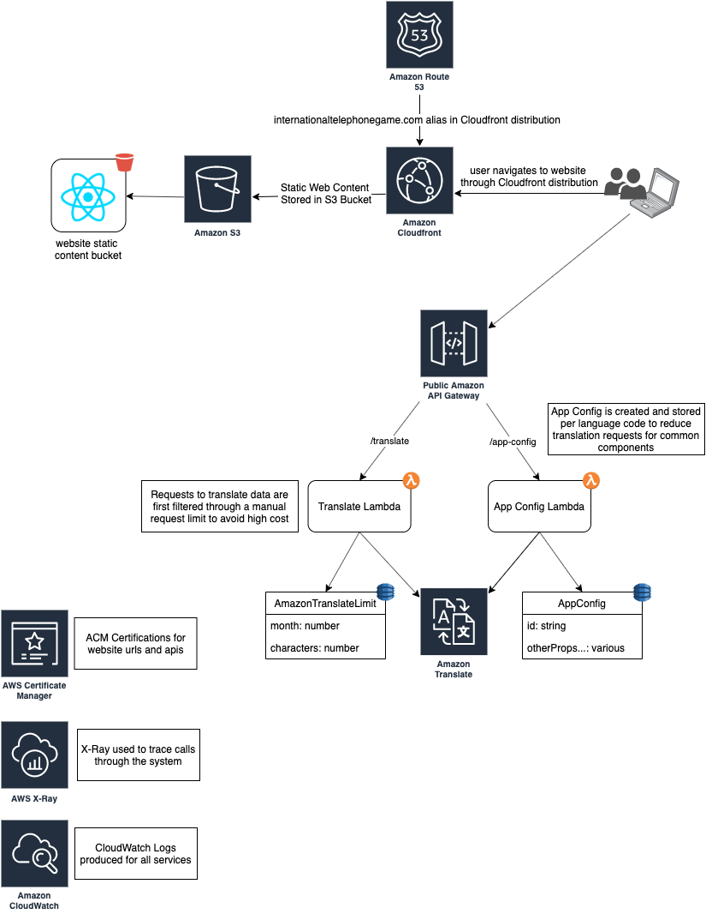

# International Telephone Game

This is a simple website that allows you to create a telephone game between languages. You can also do basic language to language translations. This is backed by AWS Translate and supports all their supported languages. 

## Architecture

The system is a very simple system that utilizes the basics off a react static website and lambda functions to orchestrate data for the few functions of the app. All requests to translate data are filtered through a request limiter to avoid any malicious behavior to run up a bill on the account and the various website configurations are created and stored in Dynamo as they are requested to further avoid any duplicate calls to AWS Translate.



## Setup
You can stand up this stack yourself if you'd like! Follow the instructions at [AWS CDK Getting Started](https://docs.aws.amazon.com/cdk/latest/guide/getting_started.html) to ensure your machine is setup correctly to use the Amazon Cloud Development Kit(CDK).

If you haven't used the cdk in your aws account yet, you'll need to bootstrap it with the following:

```
$ cdk bootstrap aws://<account_id>/<region>
```

## Deploy
All of the services use the aws cloud development kit except for the web-app

To deploy the backend:
```
$ cd $BASE_DIR/language-graph-infra
$ npm run build
$ cdk deploy
```

The webapp cloudformation template has parameters for the domain related information that can be configured as needed.

To deploy the webapp:
```
cd $BASE_DIR/web-app
sam build
sam deploy
npm run-script build
aws s3 sync build/ s3://internationaltelephonegame.com --acl public-read
```

Note: You must have appropriate access and secret keys setup on your machine for the AWS account